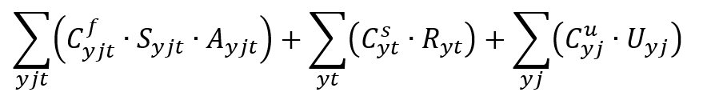

# Technical Documentation

## INDEX  
[Model Variable](tech-guide.md#model-variables)
[Model Variable](#objective-function)

## Model Variables

For this model we can categorise the variables given to the the optimiser as of 
two types:  
1. Variables representing the number of judges allocated to each jurisdiction 
(**allocation variables**); and  
2. Variables representing the numbers of judges available, newly hired and newly 
departed (hereafter known as **resource variables**).

All variables represent numbers of judges in FTE rather than headcount terms.

The total number of variables is dependent on the number of years in the future 
the model covers, the number of different types of jurisdiction and the number 
of different types of judge. These are all things which can be changed by the user.

In this code implementation these variables are placed in a specifc order. Think 
of them as column headings in a table. There are columns for each of the allocation 
variables first, then for each of the resource variables. There is one allocation 
variable for every combination of year, jurisdiction and judge type (in that 
order). There is on resource variable for each year, judge type and “status” (in 
that order). A “status” is one of three categories: judges in-post (A); judges 
newly hired (I); judges who’ve left (O).

To illustrate, here is an example where there are only 2 years, 2 jurisdictions 
and 2 judge types. Note that the model will always add one extra ‘dummy’ judge 
type, used to creat allocation variables which count the volume of unallocated 
sitting days (i.e. unmet demand). This is represented by the ‘U’ Judge Type in 
the table below.

### Allocation Variables

Variable #  | 1 | 2 | 3 | 4 | 5 | 6 | 7 | 8 | 9 | 10 | 11 | 12 
------------|---|---|---|---|---|---|---|---|---|----|----|----
Year        | 1 | 1 | 1 | 1 | 1 | 1 | 2 | 2 | 2 |  2 |  2 |  2 
Jursdiction | 1 | 1 | 1 | 2 | 2 | 2 | 1 | 1 | 1 |  2 |  2 |  2 
Judge Type  | 1 | 2 | U | 1 | 2 | U | 1 | 2 | U |  1 |  2 |  U 

### Resource Variables

Variable #  | 13 | 14 | 15 | 16 | 17 | 18 | 19 | 20 | 21 | 22 | 23 | 24 
------------|----|----|----|----|----|----|----|----|----|----|----|----
Year        |  1 |  1 |  1 |  1 |  1 |  1 |  2 |  2 |  2 |  2 |  2 |  2 
Judge Type  |  1 |  2 |  U |  1 |  2 |  U |  1 |  2 |  U |  1 |  2 |  U 
Status      |  A |  I |  O |  A |  I |  O |  A |  I |  O |  A |  I |  O 

This gives us a total of 12 allocation variables and a further 12 resource 
variables: 24 in total. Variable #8, for example, represents the number of 
judges of type 2 allocated to jurisdiction 1 in year 2. Variable #22 represents 
the number of judges of type 2 available to be allocated to work (in any 
jurisdiction) in year 2.

The real model follows the same pattern but is obviously larger. With 10 years, 
15 jurisdictions and 8 judge types, there are 1,350 allocation variables and 240 
resource variables: 1,590 variables in total.

## Objective Function

The objective function is to minimise total cost, subject to the following definitions.

Total cost =  
1. [Sum of per sitting-day cost of fee-paid judges] + 
2. [Sum of total cost of all salaried judges] + 
3. [Sum of per-sitting day penalty costs for any unsatisfied demand]

Minimise:

**EQ-000** |   |
-----------|---|----------------------------
Where:     |   |  
Cf/yjt     | = | Average cost of one sitting day (fees) for judge of type t in jurisdiction j in year y
Syjt       | = | Number of sitting days a single judge of type t can provide for jurisdiction j in year y
Ayjt       | = | Number of judges of type t allocated to provide sitting days for jurisdiction j in year y
Cs/yt      | = | Average annual cost (salary) of judge of type t in year y
Ryt        | = | Total number of judges of type t in post in year y
Cu/yt      | = | Nominal per-sitting-day penalty associated with being unable to satisfy demand in juridiction j in year y
Uyj        | = | Total number of sitting-days unallocated – i.e. to which no judge could be allocated – for jurisdiction j in year y 

This formulation does give the flexibility to specify a combination of variable 
(fee) and fixed (salary) costs for a judge, should that be something desirable 
to model in future.

